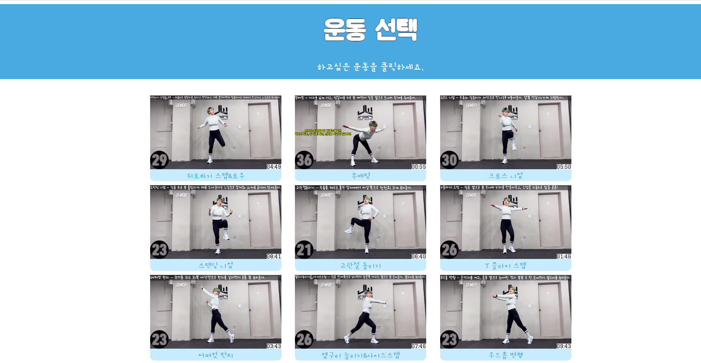

# MyCoachMe
openpose와 영상 합성을 활용한 운동 웹사이트

## 웹사이트 소개
영상 합성을 통해 전문가처럼 운동하는 본인의 모습을 보며 운동하고,
운동 결과 분석 및 운동 추천을 해주는 웹사이트이다.

영상 합성으로는 [Everybody Dance Now](https://github.com/carolineec/EverybodyDanceNow) 논문과 코드를 참고하였음

해당 github에서는 로컬로만 실행할 수 있고, 모델 훈련 및 합성은 제외되었음


## 실행 방법

1. [해당 링크](https://drive.google.com/file/d/1zm2PIIlOtf3JKlKAY_mhRronvmcz4EVt/view?usp=sharing)에서 openpose를 다운받아 MyCoachMe>MyCoachMe 경로에 압축 해제한다. (용량상의 문제로 분리함. 컴파일과 모델 설치가 완료된 openpose파일)
 - 다운에 문제가 생긴다면, [openpose 공식 github](https://github.com/CMU-Perceptual-Computing-Lab/openpose)에서 openpose를 다운받고, 가이드라인대로 모델을 설치한다.

2. conda 가상환경 설치 및 실행
3. 가상환경에 django 설치
    ```
    pip install django
    ```
4. 웹 실행
    ```
    #manage.py파일이 위치한 곳으로 이동하여
    python manage.py runserver
    ```
## 웹 상세 설명

1. 로그인 및 회원가입

메인화면. 로그인 및 회원가입을 할 수 있음

회원가입을 위한 정보를 입력 받음

회원가입 중, '영상 촬영' 버튼을 누르면 영상 합성을 위한 
영상 촬영을 할 수 있음
2. 운동 선택

9개의 운동 영상중 원하는 운동을 선택할 수 있음
3. 운동 화면

운동 화면. 좌측엔 유저의 캠이 우측엔 합성된 유저의 영상이 출력됨
4. 운동 결과 보고서

5개의 운동 부위에 대해 부족한 정도를 그래프로 표시함

운동 중에 가장 부족했을 때의 사진과 부위를 표시하고, 다음 운동을 추천함

## 데모 영상
[YouTube](https://www.youtube.com/watch?v=0n3AbtAsDCk)